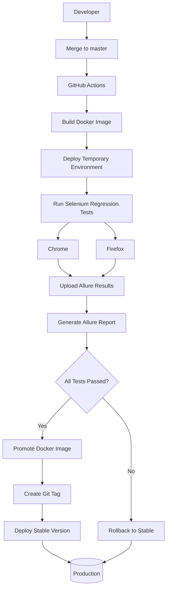

# OrangeHRM Demo for CI/CD Pipeline

This repository is a fork of the official **OrangeHRM Starter Application** and is used as a demonstration project for building a complete CI/CD pipeline with automated testing.

The primary goal of this project is **not to develop new OrangeHRM features**, but to showcase how modern DevOps and QA Automation practices can work together to deliver software safely and automatically.

The pipeline demonstrates:

- 🐳 Docker image build
- 🚀 Automatic deployment to a temporary environment
- 🤖 Automated Selenium regression testing
- 🌐 Cross-browser execution (Chrome & Firefox)
- 📊 Allure Report generation
- 📦 Automatic Docker image promotion
- 🏷 Automatic Git version tagging
- 🔄 Automatic rollback on test failures

---

## Architecture

---

# CI/CD Workflow

The workflow is automatically triggered whenever code is pushed to the **master** branch.

## 1. Build Docker Image

- Checkout source code
- Build a temporary Docker image tagged with the current Git commit SHA
- Push the image to Docker Hub

---

## 2. Deploy Temporary Environment

The temporary image is deployed to a VPS using Docker Compose.

This environment is used exclusively for automated regression testing before the image is promoted.

---

## 3. Execute Regression Tests

The workflow then:

- Starts Selenium Standalone containers
- Checks out the Selenium automation project
- Executes the regression test suite
- Runs tests in parallel on:
  - Chrome
  - Firefox
- Collects Allure result files

---

## 4. Generate Test Reports

After test execution, the pipeline automatically:

- Uploads Allure result files to the VPS
- Merges results from multiple browsers
- Generates the latest Allure Report
- Publishes the report for review

### 📊 Live Allure Report

https://chaseqa.duckdns.org/allure/

The report includes:

- Test execution summary
- Passed / Failed statistics
- Execution timeline
- Failure screenshots
- Logs and stack traces
- Browser-specific execution results

The report is automatically updated after every workflow execution.

---

## 5. Promote Release

If all regression tests pass, the pipeline will:

- Determine the next semantic version
- Promote the temporary Docker image
- Push:
  - Version tag (`x.y.z`)
  - `stable` tag
- Create a Git tag
- Deploy the new stable version

---

## 6. Automatic Rollback

If any regression test fails, the pipeline will:

- Skip image promotion
- Keep the current stable version
- Automatically redeploy the previous stable Docker image

This ensures that only fully tested releases reach the stable environment.

---

# Technology Stack

| Category | Technology |
|----------|------------|
| Application | OrangeHRM |
| CI/CD | GitHub Actions |
| Containerization | Docker, Docker Compose |
| Test Automation | Selenium, TestNG, Rest-Assured |
| Build Tool | Maven |
| Reporting | Allure Report |
| Browser Automation | Selenium Standalone |
| Image Registry | Docker Hub |
| Reverse Proxy | Traefik |
| Deployment | SSH + VPS |

---

# Pipeline Highlights

- ✅ Fully automated CI/CD pipeline
- ✅ Temporary deployment before release
- ✅ Cross-browser regression testing
- ✅ Automatic Allure report generation
- ✅ Automatic semantic versioning
- ✅ Automatic Docker image promotion
- ✅ Automatic Git tagging
- ✅ Automatic rollback when tests fail

---

# Purpose

This project serves as a practical reference implementation for integrating QA Automation into a modern CI/CD pipeline.

It demonstrates how automated testing can become a deployment gate, ensuring that only verified application versions are promoted to production.

This repository is intended for learning, experimentation, and showcasing best practices in:

- Continuous Integration (CI)
- Continuous Testing (CT)
- Continuous Delivery (CD)
- Automated Regression Testing
- Docker-based Deployment
- Test Reporting
- Release Automation
